<div align="center">

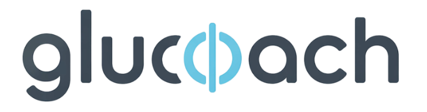

### AI 혈당 관리 헬스케어 앱

> **삼성 청년 SW·AI 아카데미 14기 자율 프로젝트** · **셋, 둘, 하나, 고 슛!**<br>
> **개발 기간**: 2026. 04. 06 ~ 2026. 06. 02 (8주)<br>
> **플랫폼**: Android Application<br>
> **개발 인원**: 6명
>
> **CGM(연속혈당측정기)** 데이터를 **실시간**으로 받아, AI가 **혈당을 예측**하고
> **AI 에이전트** **Kiki**가 식사·운동·수면 맥락을 종합해 **개인 맞춤 코칭을 제공**하는 **혈당·건강 관리 서비스**

</div>

---

## 목차

- [📌 서비스 소개](#service)
- [👥 팀원](#team)
- [✨ 주요 기능](#features)
- [🛠️ 기술 스택](#tech-stack)
- [🏗️ 시스템 아키텍처](#architecture)
- [🗄️ ERD](#erd)
- [📋 API 명세](#api)
- [🔬 핵심 기술 상세](#tech-detail)

---

<a name="service"></a>

## 📌 서비스 소개

**GluCoach**는 단순 기록 앱이 아니라 **AI가 먼저 말을 거는 능동형 혈당 코칭 서비스**입니다.

- **타깃**: 혈당 및 건강 관리가 필요한 모든 사용자
- **핵심 가치**
    1. CGM 센서 **실시간 혈당 모니터링**
    2. LSTM 기반 **AI 혈당 예측**
    3. **사진 한 장**으로 끝나는 식사 기록
    4. LLM 기반 **능동형 코칭 에이전트 Kiki**
- **차별점**: 기상 후·식후·고저혈당 상황에서 **에이전트 Kiki가 먼저 코칭**하고, **Wear OS 워치**를 연동해 앱 기능을 편리하게 이용할 수 있습니다.

---

<a name="team"></a>

## 👥 팀원

<table>
  <tr>
    <td align="center">
      <br/>
      <b>조하원</b><br/>
      <sub>팀장 · FE · BE · AI · Infra</sub><br/>
      <sub>@godhw1018</sub>
    </td>
    <td align="center">
      <br/>
      <b>이도현</b><br/>
      <sub>BE · AI</sub><br/>
      <sub>@ehtm01</sub>
    </td>
    <td align="center">
      <br/>
      <b>김정훈</b><br/>
      <sub>BE · AI</sub><br/>
      <sub>@kik1232198</sub>
    </td>
  </tr>
  <tr>
    <td align="center">
      <br/>
      <b>남윤주</b><br/>
      <sub>BE · AI</sub><br/>
      <sub>@skadbsnwk</sub>
    </td>
    <td align="center">
      <br/>
      <b>박미영</b><br/>
      <sub>FE · AI</sub><br/>
      <sub>@a29279</sub>
    </td>
    <td align="center">
      <br/>
      <b>손효지</b><br/>
      <sub>FE · AI</sub><br/>
      <sub>@hyoji0284</sub>
    </td>
  </tr>
</table>

---

<a name="features"></a>

## ✨ 주요 기능

<table>
  <tr>
    <td width="45%" align="center">
      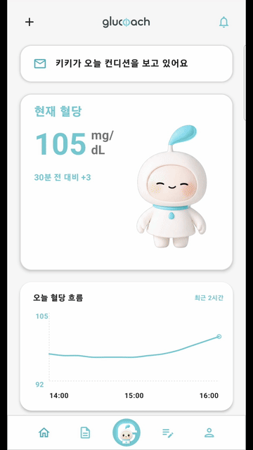
    </td>
    <td width="55%" valign="middle">
      <b>🤖 AI 코칭 에이전트 Kiki</b><br/><br/>
      기상 후·식후·고저혈당 상황에서 Kiki가 먼저 코칭을 시작합니다.<br/>
      음식 추천·운동 팁·혈당 요약을 LLM Tool-calling으로 생성하며, 30분 중복 방지로 알림 피로도를 관리합니다.
    </td>
  </tr>
  <tr>
    <td width="55%" valign="middle">
      <b>📷 AI 음식 인식</b><br/><br/>
      음식 사진 한 장으로 음식명·영양정보(탄·단·지·칼로리)를 자동 기록합니다.<br/>
      임베딩 기반 prototype 검색으로 재학습 없이 신규 음식을 인식합니다.
    </td>
    <td width="45%" align="center">
      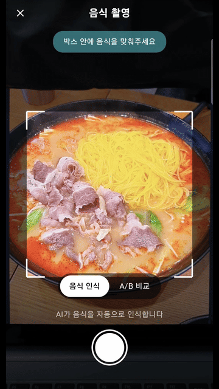
    </td>
  </tr>
  <tr>
    <td width="45%" align="center">
      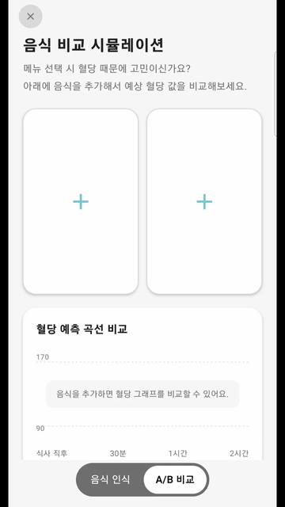
    </td>
    <td width="55%" valign="middle">
      <b>🔬 A/B 비교 시뮬레이션</b><br/><br/>
      CGM 시뮬레이터로 다양한 혈당 시나리오를 재현합니다.<br/>
      어떤 음식이 내게 잘 맞는지 미리 확인할 수 있습니다.
    </td>
  </tr>
  <tr>
    <td width="55%" valign="middle">
      <b>🍽️ 음식 성적표</b><br/><br/>
      식사 로그와 음식 등급(Food Grade)으로 식단을 평가하고,<br/>
      식전·식후 혈당 변화를 한눈에 비교합니다.
    </td>
    <td width="45%" align="center">
      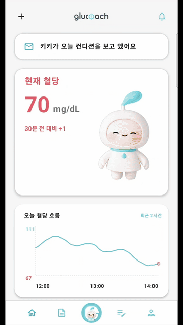
    </td>
  </tr>
  <tr>
    <td width="45%" align="center">
      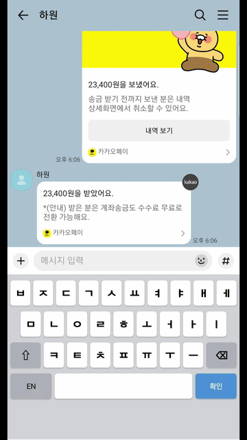
    </td>
    <td width="55%" valign="middle">
      <b>⌨️ GluCoach 키보드</b><br/><br/>
      커스텀 Android IME로, 어떤 앱에서든 키보드로 음식을 검색·기록합니다.<br/>
      19,600개 음식 DB와 개인화 등급을 탑재해 앱을 열지 않고도 빠르게 기록할 수 있습니다.
    </td>
  </tr>
  <tr>
    <td width="55%" valign="middle">
      <b>💡 디지털 트윈</b><br/><br/>
      CGM 데이터에 맞춰 키키가 반응합니다.<br/>
      나의 현재 상태를 캐릭터로 쉽게 볼 수 있습니다.
    </td>
    <td width="45%" align="center">
      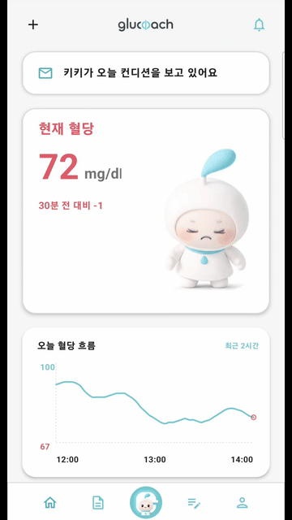
    </td>
  </tr>
  <tr>
    <td width="45%" align="center">
      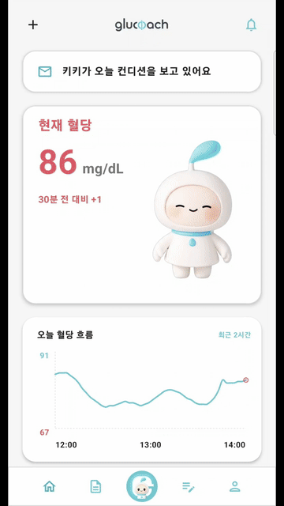
    </td>
    <td width="55%" valign="middle">
      <b>📄 주간 리포트</b><br/><br/>
      LLM이 한 주의 혈당·식사·수면·운동 데이터를 분석해<br/>
      개인 맞춤 PDF 건강 리포트를 생성합니다.
    </td>
  </tr>
  <tr>
    <td width="55%" valign="middle">
      <b>⌚ Wear OS 워치 앱</b><br/><br/>
      워치 타일·컴플리케이션으로 혈당을 손목에서 바로 확인합니다.<br/>
      Wear OS와 연동해 실시간 혈당 수치를 항상 볼 수 있습니다.
    </td>
    <td width="45%" align="center">
      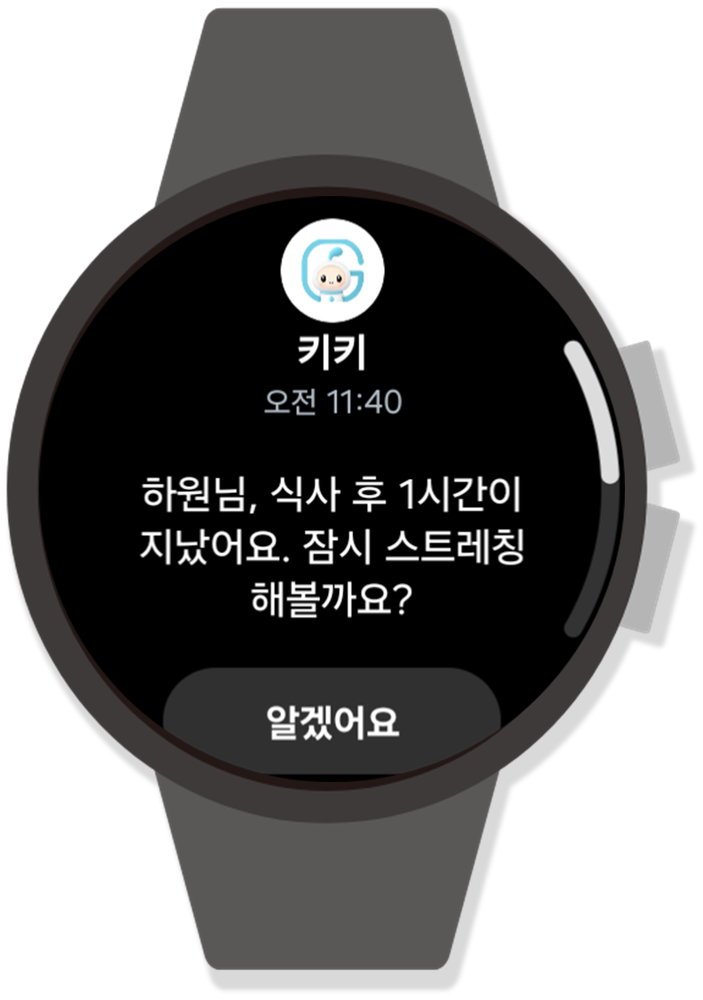
    </td>
  </tr>
</table>

<br>

| 기능                        | 설명                                                                       |
| --------------------------- | -------------------------------------------------------------------------- |
| 🩸 **실시간 혈당 모니터링** | BLE로 CGM 센서를 연결해 실시간 혈당 그래프 제공 (시뮬레이터 데이터 내장)   |
| 📈 **AI 혈당 예측**         | LSTM 모델로 식후·현재 시점 기준 향후 120분 혈당 곡선을 개인화 예측         |
| 💬 **Kiki 채팅**            | 에이전트와의 대화형 인터페이스, 명령 버튼(음식 추천 / 혈당 체크 / 운동 팁) |
| 🔔 **푸시 알림 + 음성**     | FCM 고·저혈당 경고 및 코칭 알림, TTS 음성 안내                             |
| 😴 **건강 데이터 연동**     | Health Connect로 수면·걸음수를 수집해 코칭 맥락에 반영                     |
| 🧭 **온보딩**               | 당뇨 유형 선택, 목표 혈당 범위·기본 건강 정보 설정                         |

---

<a name="tech-stack"></a>

## 🛠️ 기술 스택

| 분류                   | 기술                                                                                                                                                                                                                                                                                                                                                                                                                                                                                                                                                                                                                                                                                                                                                                                                                                                                                                                                                                                                                                                                                                                                                                                           |
| ---------------------- | ---------------------------------------------------------------------------------------------------------------------------------------------------------------------------------------------------------------------------------------------------------------------------------------------------------------------------------------------------------------------------------------------------------------------------------------------------------------------------------------------------------------------------------------------------------------------------------------------------------------------------------------------------------------------------------------------------------------------------------------------------------------------------------------------------------------------------------------------------------------------------------------------------------------------------------------------------------------------------------------------------------------------------------------------------------------------------------------------------------------------------------------------------------------------------------------------- |
| **Frontend (Android)** |                                                                                                                              |
| **Backend**            |            |
| **AI**                 |                                                                                                                                                                                                                                                                                                                                                                                             |
| **Infra**              |                                                                                                                                                                                                                                                                                                                                                                                                                                                                                                                                                                                                                                                                                         |

---

<a name="architecture"></a>

## 🏗️ 시스템 아키텍처

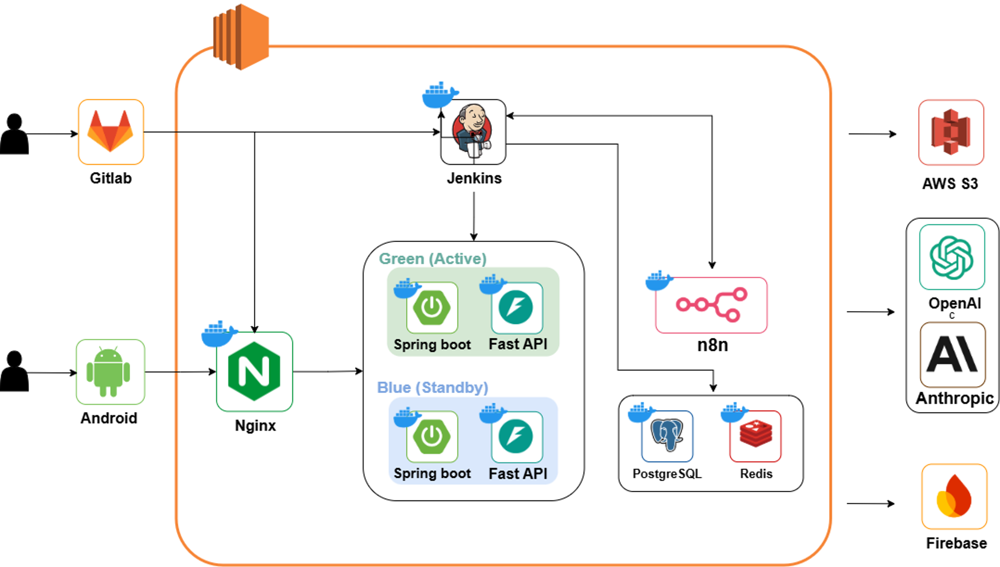

- **앱 → BE**: REST(JWT 인증)
- **BE ↔ AI**: 내부 통신(`X-Agent-Api-Key`). BE 스케줄러가 AI 에이전트를 트리거하면, AI가 BE의 `/api/agent/*` 데이터 API를 역호출해 혈당·식사·수면·걸음수 맥락을 수집한 뒤 FCM으로 코칭을 발송
- **데이터**: PostgreSQL(영속), Redis(캐시/세션), S3(음식 이미지)

---

<a name="erd"></a>

## 🗄️ ERD

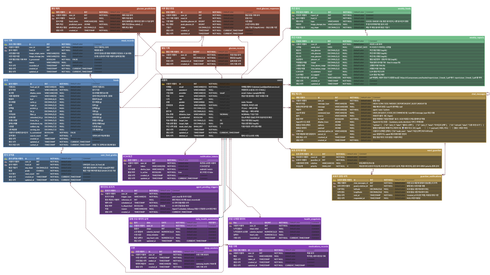

---

<a name="api"></a>

## 📋 API 명세

<details>
<summary><b>Swagger UI 스크린샷 펼치기</b></summary>

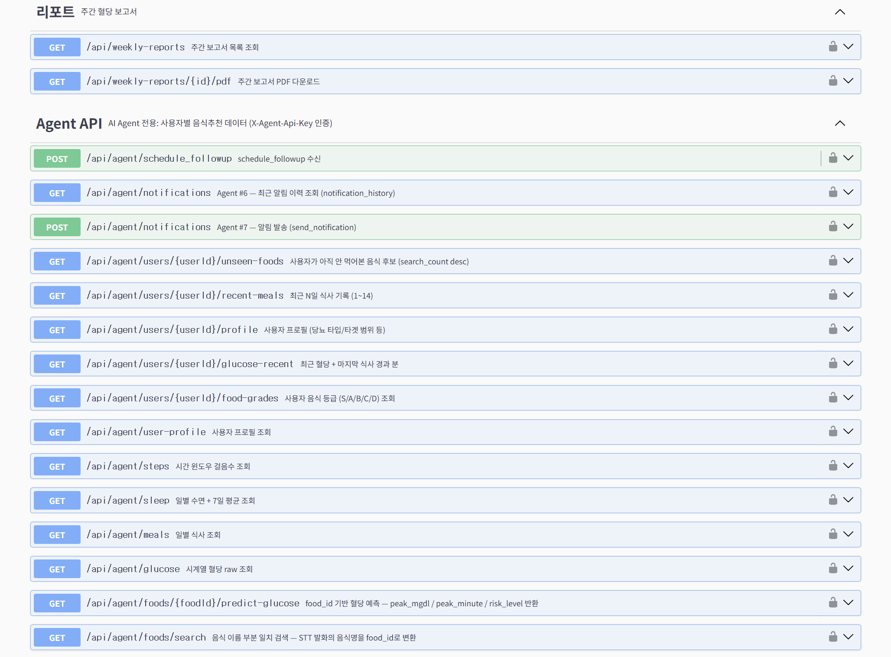
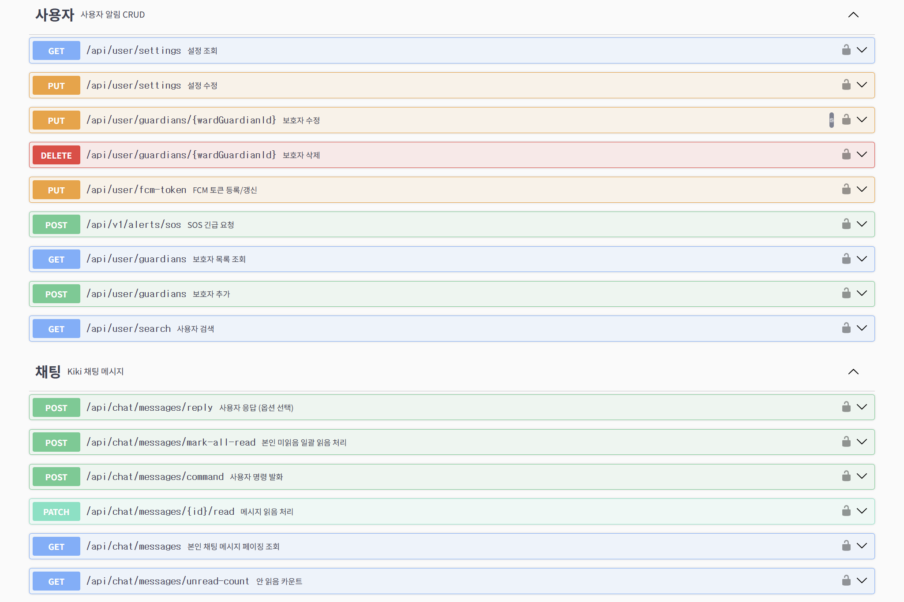
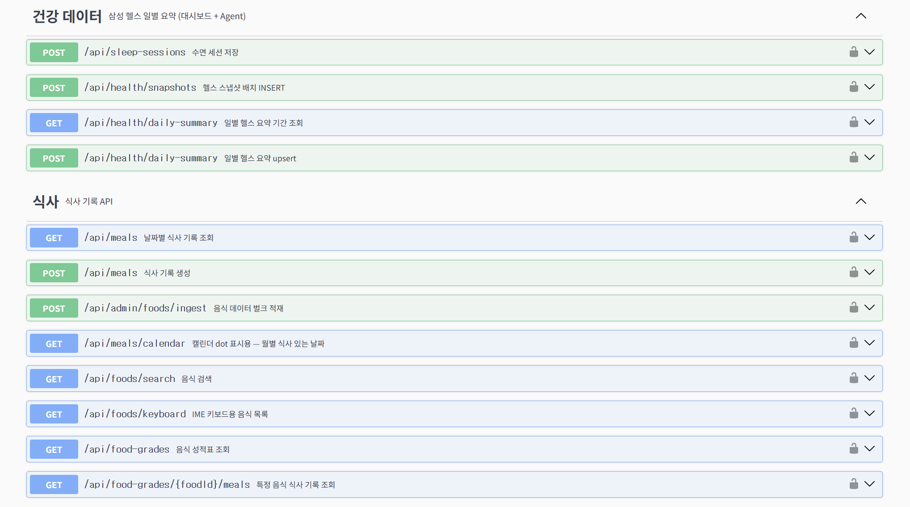
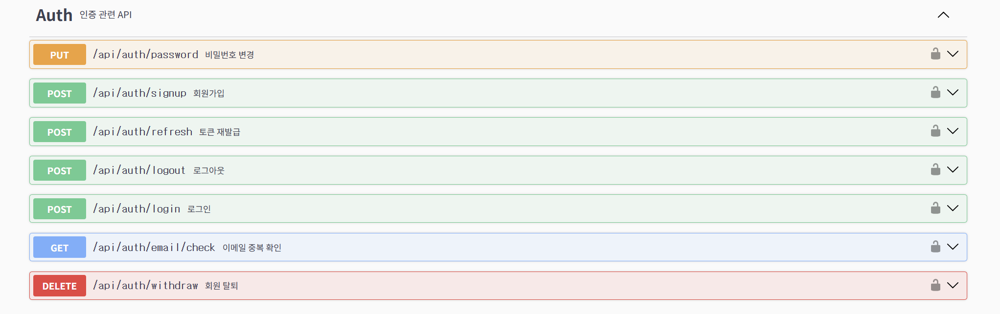
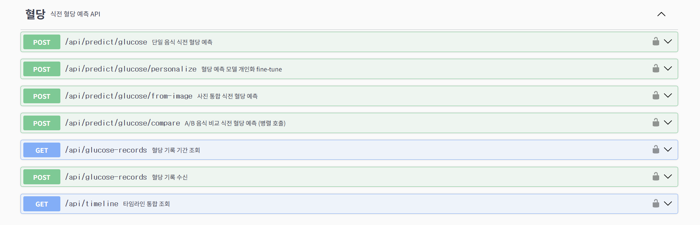

</details>

---

<a name="tech-detail"></a>

## 🔬 핵심 기술 상세

### AI 혈당 예측 (LSTM)

- 식사 시점 기준(식후 120분) / 현재 시점 기준(향후 120분) 두 가지 예측 모델
- Shanghai 공개 데이터셋으로 학습 후 사용자 데이터로 개인화
- 모델 부재 시 더미 폴백으로 graceful degradation

### AI 음식 인식 (임베딩 검색)

- 이미지 → 임베딩 → prototype DB 코사인 유사도 → Top-k 음식명
- 신규 음식은 prototype 벡터만 추가하면 **재학습 없이** 인식 가능

### AI 코칭 에이전트 Kiki (LLM Tool-calling)

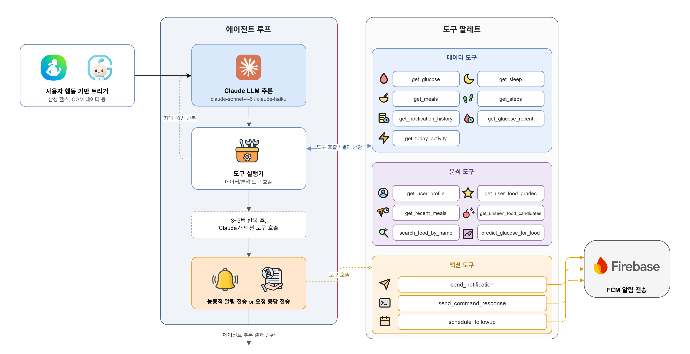

- morning / post-meal / 식후 follow-up 시나리오별 능동 코칭
- 사용자 명령(음식 추천 / 혈당 체크 / 운동 팁)에 대한 응답 생성
- 30분 중복 발송 방지(dedup)로 알림 피로도 관리

---

<details>
<summary><b>🚀 개발자 가이드 (빌드 · 실행)</b></summary>

### Backend

```bash
cd backend
./gradlew bootRun
# http://localhost:8080/api/health → {"status":"UP"}
# http://localhost:8080/swagger-ui.html → API 문서
```

### Frontend

1. Android Studio에서 `frontend/` 폴더 열기 (JDK 17, compileSdk 36, minSdk 24)
2. Gradle Sync 완료 대기
3. 에뮬레이터 또는 실기기에서 Run

### AI

```bash
cd ai
uv sync              # 또는 pip install -r requirements.txt
uv run uvicorn app.main:app --reload
# http://localhost:8000/health → {"status":"UP"}
# http://localhost:8000/docs → Swagger UI
```

### Docker Compose (전체)

```bash
cd infra
cp .env.example .env
docker compose up -d
```

> 상세 환경 셋업, 코드 컨벤션, 트러블슈팅은 [docs/DEV_GUIDE.md](docs/DEV_GUIDE.md)를 참고하세요.

</details>

<details>
<summary><b>📁 디렉토리 구조</b></summary>

```
S14P31S309/
├── backend/       ← Spring Boot (Java) 서버
├── frontend/      ← Android (Kotlin + Compose) 앱 + Wear OS
├── ai/            ← FastAPI AI 서버 (혈당 예측 · 음식 인식 · 코칭 에이전트)
├── infra/         ← Docker Compose, Nginx, Jenkins
├── docs/          ← 프로젝트 문서
└── exec/          ← SSAFY 산출물 (포팅 매뉴얼, 시연 시나리오)
```

</details>

<details>
<summary><b>🌿 브랜치 전략 & 커밋 컨벤션</b></summary>

### 브랜치 전략

```
master   ← 최종 배포 (태그로 버전 관리)
  ↑
release  ← 배포 전 QA (전체 기능)
  ↑
develop  ← 전체 통합
```

| 브랜치                             | 역할                           | PR 대상               |
| ---------------------------------- | ------------------------------ | --------------------- |
| `master`                           | 최종 배포                      | `release`에서 MR      |
| `release`                          | 전체 기능 QA                   | `develop`에서 MR      |
| `develop`                          | 전체 통합                      | `release`             |
| `develop-client`                   | 클라이언트 요구 기능 현황 관리 | `develop`             |
| `{파트}/feature-{기능}-{이슈번호}` | 기능 개발                      | 유형에 따라           |
| `hotfix/{기능}-{이슈번호}`         | 긴급 수정                      | `release` + `develop` |

- **파트**: `fe` / `be` / `ai` / `infra`
- **이슈번호**: `S14P31S309-XXX` 형식 (예: `fe/feature-login-S14P31S309-131`)

### 커밋 컨벤션

```
[#XXX] {유형}: {설명}
```

| 유형       | 설명             | 유형     | 설명           |
| ---------- | ---------------- | -------- | -------------- |
| `feature`  | 새로운 기능 추가 | `design` | UI 디자인 변경 |
| `fix`      | 버그 수정        | `test`   | 테스트 코드    |
| `docs`     | 문서 수정        | `chore`  | 기타 설정      |
| `refactor` | 코드 리팩토링    | `revert` | 되돌리기       |

</details>
