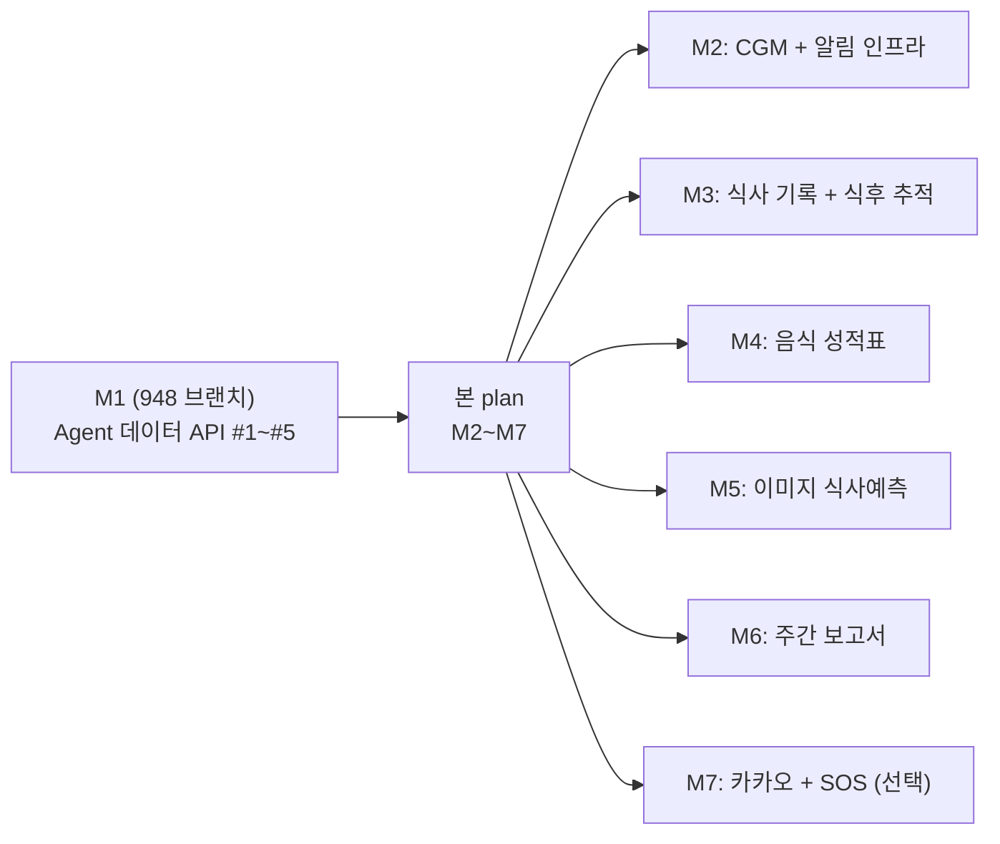
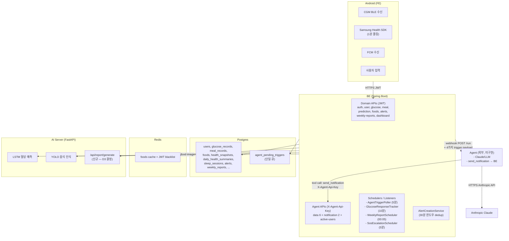
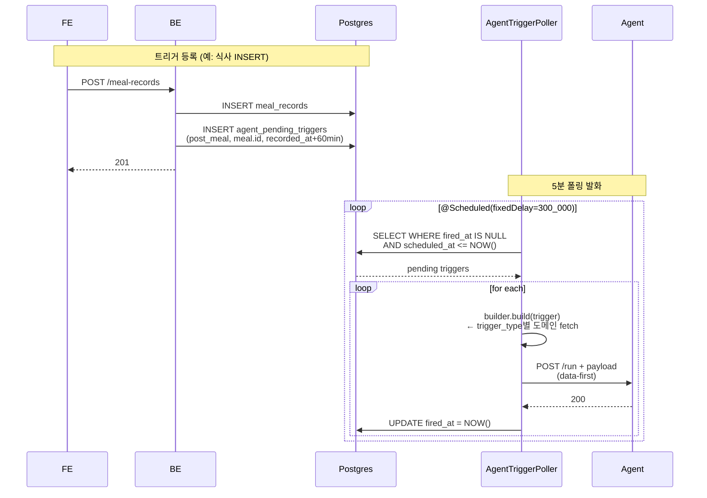

# GlucoCoach BE 재설계 — 통합 로드맵

## Context

GlucoCoach는 원래 `glucocoach_feature_detail.html` (10개 기능, 1992줄)을 기준으로 설계됐다. 2026-05-02 **AI Agent 도입** 결정 + 2026-05-03 세부 결정 라운드를 통해 책임 재분배가 확정됐다.

### 프로젝트 컨텍스트
- **데드라인**: 미정. M2부터 순서대로 진행, 데드라인 확정 시 어느 milestone에서 끊을지 재결정.
- **팀 구성**: BE / Agent / AI / FE 모두 같은 명소. D1~D8 결정은 면대면 합의 가능.
- **CGM 데이터**: 시연 시점에는 FE 시뮬레이터 학습 모델이 5분마다 더미 생성 → BE POST. BE 입장에선 실제 vs 시뮬 동일.

### 진행 중 (M1)
948 브랜치 (`be/feature-step-records-S14P31S309-948`) — Agent 데이터 API #1~#5 (#971~#989 발급 완료). **본 plan 시작 전에 머지**.

### 이 plan의 책임 (M2~M7)



---

## 1. 시스템 아키텍처



### 컴포넌트 책임

| 컴포넌트 | 책임 |
|---|---|
| **Android (FE)** | UI, Samsung Health 폴링, CGM BLE 수신, FCM 수신, 사용자 입력. AI 서버·agent 직접 호출 X |
| **BE (Spring)** | 도메인 API, 알림 발송 파이프, 룰 트리거(HIGH/LOW), 모든 스케줄러, agent 데이터 제공 API, agent webhook 호출 클라이언트 |
| **AI Server (FastAPI)** | LSTM 혈당 예측 (라이브), YOLO 음식 인식 (라이브), LLM 요약 (M6에서 신규 추가) |
| **Agent (외부)** | morning/post-meal/wake_up 등 의사결정, send_notification으로 BE 호출. **현재 미구현** |
| **Postgres** | 영속 데이터. Flyway V1~V3 (현행) → V4~V8 (본 plan) |
| **Redis** | foods 검색 캐시, JWT blacklist |

---

## 2. 10개 기능 책임 재배치

| # | 기능 | BE | Agent | AI 서버 | FE | 현재 상태 |
|---|---|---|---|---|---|---|
| ① | 회원가입 | 단일 가입 (D5 미정) | — | — | 7-step UI | 🟡 4필드 라이브 |
| ② | 로그인 | 이메일+카카오 | — | — | 카카오 SDK | 🟡 카카오 미구현 |
| ③ | 대시보드 | 통합 GET | — | — | 표시 | 🟡 변형 (TimelineService) |
| ④ | 혈당 수신 | POST + Spring Event | (event 구독) | — | CGM BLE / 시뮬 | 🔴 BE 컨트롤러 없음 |
| ⑤ | 알림 | 룰 트리거 + alerts CRUD + FCM + agent 입구 | send_notification 호출 | — | FCM 수신 | 🔴 alerts 도메인 부재 |
| ⑥ | 식사 예측 | AI 호출 + Bergman | — | LSTM/YOLO | 카메라 + 결과 | 🟡 텍스트만 |
| ⑦ | 음식 비교 | 병렬 AI 호출 | — | LSTM | 비교 화면 | 🟢 구현 완료 |
| ⑧ | 식사 기록 | POST + 식후 추적 | — | — | 입력 화면 | 🔴 컨트롤러 없음 |
| ⑨ | 음식 성적표 | UPSERT + S/A/B/C/D | (조회만) | — | 성적표 화면 | 🔴 미구현 |
| ⑩ | 주간 보고서 | 스케줄러 + LLM 호출 + iText7 PDF | — | LLM endpoint | 보고서 화면 | 🔴 미구현 |

---

## 3. Agent 트리거 모델 — 핵심 신설 인프라

### 3.1 큐 테이블

```sql
-- V4 일부
CREATE TABLE agent_pending_triggers (
  id BIGSERIAL PRIMARY KEY,
  user_id INT NOT NULL REFERENCES users(id),
  trigger_type VARCHAR(30) NOT NULL,
  context_id BIGINT,                       -- 도메인 row PK or NULL
  scheduled_at TIMESTAMP NOT NULL,         -- 발화 예정 시각 (KST)
  fired_at TIMESTAMP,                       -- NULL이면 미발화
  failed_count INT NOT NULL DEFAULT 0,
  last_error VARCHAR(500),
  created_at TIMESTAMP NOT NULL DEFAULT NOW()
);
CREATE INDEX idx_triggers_pending
  ON agent_pending_triggers (scheduled_at) WHERE fired_at IS NULL;
```

### 3.2 trigger_type 카탈로그

| trigger_type | 등록 시점 | scheduled_at | context_id가 가리키는 곳 |
|---|---|---|---|
| `post_meal` | POST /meal-records 시 | meal.recorded_at + 60min | `meal_records.id` |
| `wake_up` | POST /sleep-sessions 시 | sleep.end_at + 10min | `sleep_sessions.id` |
| `post_glucose_high` | (선택) HIGH 알림 발생 시 | glucose.measured_at + 30min | `glucose_records.id` |
| `morning` | (사용 안 함) wake_up이 대체 | - | - |

### 3.3 발화 흐름



### 3.4 AgentPayloadBuilder 패턴 (BE 코드)

```java
interface AgentPayloadBuilder {
  String triggerType();
  Map<String, Object> build(AgentPendingTrigger trigger);
}

@Component
class PostMealPayloadBuilder implements AgentPayloadBuilder {
  public String triggerType() { return "post_meal"; }
  public Map<String, Object> build(trigger) {
    var meal = mealRepo.findById(trigger.contextId());
    var glucose = glucoseRepo.findAroundMeal(trigger.userId(), meal.recordedAt(), Duration.ofHours(2));
    var profile = userRepo.findProfile(trigger.userId());
    var recentNotifs = alertRepo.findRecent(trigger.userId(), Duration.ofHours(1));
    return Map.of(
      "trigger_type", "post_meal",
      "user_id", trigger.userId(),
      "fired_at", Instant.now(),
      "context", Map.of(
        "meal", meal,
        "glucose_around_meal", glucose,
        "user_profile", profile,
        "recent_notification_history", recentNotifs
      )
    );
  }
}

// WakeUpPayloadBuilder, PostGlucoseHighPayloadBuilder도 같은 패턴
```

### 3.5 trigger_type별 payload 스키마

#### post_meal
```json
{
  "trigger_type": "post_meal",
  "user_id": 42,
  "fired_at": "2026-05-03T13:30:05",
  "context": {
    "meal": { "meal_id": 77, "food_name": "김치찌개", "carbs_g": 18.0, "recorded_at": "..." },
    "glucose_around_meal": [{ "timestamp": "...", "value": 110 }, ...],
    "user_profile": { "diabetes_type": "T2D", "target_low": 70, "target_high": 140 },
    "recent_notification_history": [...]
  }
}
```

#### wake_up
```json
{
  "trigger_type": "wake_up",
  "user_id": 42,
  "fired_at": "2026-05-03T07:10:00",
  "context": {
    "sleep": { "sleep_session_id": 99, "start_at": "...", "end_at": "...", "duration_minutes": 480 },
    "yesterday_glucose_summary": { "avg": 138, "tir": 65, "min": 78, "max": 195 },
    "yesterday_steps": 8400,
    "user_profile": {...}
  }
}
```

#### post_glucose_high (선택)
```json
{
  "trigger_type": "post_glucose_high",
  "user_id": 42,
  "fired_at": "...",
  "context": {
    "glucose_event": { "glucose_id": 12345, "value": 195, "measured_at": "..." },
    "trend_60min": [{ "timestamp": "...", "value": ... }],
    "user_profile": {...}
  }
}
```

---

## 4. 데이터 흐름 시나리오 (시퀀스)

### A. CGM 혈당 수신 → 룰 알림 + (선택) agent post_glucose_high

```
CGM기기 → BLE → Android → POST /api/v1/glucose-records (JWT)
  → BE: glucose_records INSERT
  → BE: GlucoseReceivedEvent (AFTER_COMMIT)
       ├→ AlertTriggerService (룰)
       │   └→ value≥180 → AlertCreationService.createIfNotDuplicate(HIGH)
       │       → 30분 내 같은 type 미해결 없으면 INSERT + FCM
       │       → channel_id=glucose_critical
       └→ (선택) agent_pending_triggers INSERT
            (post_glucose_high, glucose.id, measured_at + 30min)
```

### B. 삼성 헬스 (1분 폴링)

```
Samsung Health SDK → Android (1분)
  → 5분 buffer (Room queue) → POST /api/health/snapshots (batch)
       → BE: ON CONFLICT DO NOTHING (멱등)

Sleep session 종료 감지 → POST /api/health/sleep-sessions
  → BE: sleep_sessions INSERT
  → BE: agent_pending_triggers INSERT
        (wake_up, sleep_session.id, end_at + 10min)
```

### C. 식사 예측 (텍스트, 동기, ⑥)

```
Android FE → POST /api/predict/glucose (JWT)
  → BE: FoodResolverService
  → BE → AI Server: POST /api/predict/glucose/meal (LSTM)
  → BE: glucose_predictions INSERT
  → FE: 곡선 + 피크 표시
```

### D. 식사 기록 → 식후 추적 + agent 트리거

```
Android FE → POST /api/v1/meal-records (multipart) (JWT)
  → BE: S3 업로드 + meal_records INSERT (is_processed=false)
  → BE: agent_pending_triggers INSERT
        (post_meal, meal.id, recorded_at + 60min)
  → 즉시 응답

[10분마다 GlucoseResponseTracker]
  → is_processed=false + recorded_at < now()-2.5h 조회
  → baseline/peak → meal_glucose_responses INSERT
  → user_food_grades UPSERT

[5분마다 AgentTriggerPoller]
  → post_meal trigger 발화 → PostMealPayloadBuilder → agent webhook
```

### E. Agent 의사결정 (data-first, 단일 webhook 호출)

```
[AgentTriggerPoller @Scheduled(5분)]
  pending = SELECT WHERE fired_at IS NULL AND scheduled_at <= NOW();
  for each:
    payload = builder.build(trigger)  // trigger_type별 분기
    POST {agent_url}/run + payload  // ← data-first
    UPDATE fired_at = NOW()

Agent (외부)
  → Claude tool-use로 의사결정
  → (필요 시) POST /api/agent/notifications (X-Agent-Api-Key)
       Body: { user_id, alert_type: "AGENT_*", message }
       → BE: AlertCreationService.createIfNotDuplicate
       → 30분 내 같은 type 없으면 alerts INSERT + FCM
       → channel_id 매핑 (D7)
```

### F. 주간 보고서 (D3 옵션 A — BE → AI 서버 LLM)

```
[매일 00:05 WeeklyReportScheduler]
  users WHERE week_start_day = today.dayOfWeek
  for each user @Async:
    stats = aggregate(glucose_records, meal_glucose_responses, foods)
    summary = WeeklyReportLlmClient.generate(stats)  // ← BE → AI server
    pdf = iText7.build(stats, summary)
    s3.upload(pdf)
    weekly_reports INSERT + weekly_foods INSERT
    alerts INSERT (WEEKLY_REPORT) + FCM (channel_id=report_notification)
```

---

## 5. API 명세

### 5.1 ✅ 이미 구현 완료 (단일 소스: 현재 `develop` + 948)

#### 인증 (auth)
- ✅ `POST /api/auth/signup` — `SignupRequest(email, password, name, phone)` → 201 `TokenResponse`
- ✅ `POST /api/auth/login` — `LoginRequest(email, password)` → `TokenResponse`
- ✅ `POST /api/auth/refresh` — `ReissueRequest(refreshToken)` → `TokenResponse`
- ✅ `POST /api/auth/logout` — `ReissueRequest(refreshToken)` → 204
- ✅ `DELETE /api/auth/withdraw` (JWT) — `WithdrawRequest(password)` → 204

#### 사용자 (user)
- ✅ `GET /api/user/settings` (JWT) → `SettingsResponse(userId, name, age, gender, phone, height, weight, diabetesType, isMedicated, targetLow, targetHigh, weekStartDay)`
- ✅ `PUT /api/user/settings` (JWT) — `SettingsUpdateRequest` → `SettingsResponse`
- ✅ `GET /api/user/guardians` (JWT) → `List<GuardianResponse>`
- ✅ `POST /api/user/guardians` (JWT) — `GuardianRequest(guardianId, relation)` → 201 `GuardianResponse`
- ✅ `PUT /api/user/guardians/{wardGuardianId}` (JWT)
- ✅ `DELETE /api/user/guardians/{wardGuardianId}` (JWT)

#### FCM 토큰
- ✅ `PUT /api/user/fcm-token` (JWT) — `FcmTokenRequest(token, deviceType?)` → 200

#### 음식 검색
- ✅ `GET /api/foods/search?q=` (JWT) — q 1-50자 → `List<FoodSearchResult>` (DB 캐시 + 식품안전처 API)

#### 예측 (⑥⑦)
- ✅ `POST /api/predict/glucose` (JWT) — `PredictRequest(foodId?, foodName, carbsG, proteinG, fatG, kcal, sugarG?, giScore?)` → `PredictResponse(predictionId, curve, peakMgdl, peakMinute, returnMinute, confidence)`
- ✅ `POST /api/predict/glucose/compare` (JWT) — `AbPredictRequest(foodA, foodB)` → `AbPredictResponse(foodA, foodB)` (CompletableFuture 병렬)

#### 헬스 (944)
- ✅ `POST /api/health/daily-summary` (JWT) — `DailyHealthSummaryUpsertRequest(date, steps, caloriesBurned, sleepMinutes, avgHeartRate)` → `DailyHealthSummaryResponse`
- ✅ `GET /api/health/daily-summary?from=&to=` (JWT) → `List<DailyHealthSummaryResponse>`

#### 헬스 시계열 (948)
- ✅ `POST /api/health/snapshots` (JWT) — `HealthSnapshotBatchRequest(items: [{recordedAt, stepsTotal?, caloriesBurned?, heartRate?}])` → `HealthSnapshotBatchResponse(inserted, skipped)` (ON CONFLICT 멱등)

#### 타임라인
- ✅ `GET /api/timeline?range=1d|7d|30d` (JWT) → `TimelineResponse` (4쿼리 병렬)

#### Agent (948)
- ✅ `GET /api/agent/steps?user_id=&start=&end=` (X-Agent-Api-Key) → `AgentStepResponse(windowSteps)` — MAX-MIN 윈도우 쿼리

#### Agent (M1, #971~#989에서 구현 중)
- 🟡 `GET /api/agent/user-profile?user_id=` (X-Agent-Api-Key) → `{ diabetesType, targetGlucoseMin, targetGlucoseMax }`
- 🟡 `GET /api/agent/glucose?user_id=&start_time=&end_time=` (X-Agent-Api-Key) → `[{ timestamp, value }]`
- 🟡 `GET /api/agent/sleep?user_id=&date=` (X-Agent-Api-Key) → `{ date, sleepMinutes, averageSleepMinutes }`
- 🟡 `GET /api/agent/meals?user_id=&date=` (X-Agent-Api-Key) → `[{ mealId, timestamp, foodName, carbs, protein, fat, calories }]`

### 5.2 신규 — M2~M7

#### M2: CGM + 알림 + agent 인프라

**CGM 수신**
```
POST /api/v1/glucose-records (JWT)
  Req: { value: 20-600 (double), measured_at: "yyyy-MM-ddTHH:mm:ss" (KST LocalDateTime) }
  Res: 201 { id, value, measured_at, created_at }
  검증: value 범위 / measured_at 미래 시각 reject (now+5min 초과)
  멱등: (user_id, measured_at) UNIQUE
  부수효과: GlucoseReceivedEvent (AFTER_COMMIT) → AlertTriggerService

GET /api/v1/glucose-records?from=&to= (JWT)
  Res: { content[], total_count }

GET /api/v1/glucose-records/hba1c (JWT)
  Res: { estimated_hba1c, avg_glucose_90d, diabetes_group, source: "estimated"|"manual", data_days }
  로직: eA1c = (avg_90d + 46.7) / 28.7. 90일 부족 시 users.hba1c_manual fallback
```

**Alert 도메인**
```
GET /api/v1/alerts?is_read=&page=&size= (JWT)
  Res: { content[], unread_count }

PATCH /api/v1/alerts/{id}/read (JWT)
  Res: 200

POST /api/v1/alerts/sos (JWT)
  Req: { latitude, longitude }
  Res: 201 { alert_id, message }
  부수효과: ward_guardian 조회 → 1순위 보호자 FCM (channel_id=glucose_critical)
```

**Agent 알림 입구**
```
GET /api/agent/notifications?user_id=&hours= (X-Agent-Api-Key)
  → Tool #6 (notification_history)
  Res: [{ alert_id, alert_type, message, created_at, is_read }]

POST /api/agent/notifications (X-Agent-Api-Key)
  → Tool #7 (send_notification)
  Req: { user_id, alert_type: "AGENT_*", message, data?: {} }
  Res: 201 { alert_id } 또는 200 { skipped: true } (30분 dedup 시)
  부수효과: AlertCreationService.createIfNotDuplicate → alerts INSERT + FCM

GET /api/agent/users/active (X-Agent-Api-Key)
  → agent 자체 cron이 "어떤 사용자 순회할지" 알 때 사용 (현재 plan은 wake_up이 대체하므로 우선순위 낮음)
  Res: [{ user_id, last_active_at, week_start_day }]
```

#### M2.5: sleep_sessions (수면 세션)

```
POST /api/health/sleep-sessions (JWT)
  Req: { startAt: "...", endAt: "...", durationMinutes }
  Res: 201 { id, startAt, endAt, durationMinutes }
  부수효과: agent_pending_triggers INSERT (wake_up, session.id, endAt+10min)

GET /api/health/sleep-sessions?from=&to= (JWT)
  Res: List<SleepSessionResponse>
```

#### M3: 식사 기록 + 식후 추적

```
POST /api/v1/meal-records (multipart, JWT)
  Form: food_name, amount_g, memo?, recorded_at, image?
  Res: 201 { id, food_id, food_name, amount_g, carb_g, recorded_at, image_url, is_processed: false }
  부수효과: 
    - S3 업로드 (이미지)
    - meal_records INSERT (is_processed=false)
    - agent_pending_triggers INSERT (post_meal, meal.id, recorded_at+60min)

GET /api/v1/meal-records?date=&page=&size= (JWT)
GET /api/v1/meal-records/{id} (JWT)

(내부 — 외부 노출 없음)
- GlucoseResponseTracker @Scheduled(10분)
- AgentTriggerPoller @Scheduled(5분)
```

#### M4: 음식 성적표

```
GET /api/v1/food-grades?grade=&page=&size= (JWT)
  Res: { content[], grade_summary: {S,A,B,C,D} }

GET /api/v1/food-grades/{food_id} (JWT)
  Res: { food_name, slope_history[], avg_slope, grade, meal_count, ... }
```

#### M5: 이미지 식사예측

```
POST /api/v1/predictions/image (multipart, JWT)
  Form: image, current_glucose?, amount_g?
  Res: 201 { prediction_id, food_id, food_name, carb_g, predicted_curve[], predicted_peak, peak_time_min, confidence_band, is_customized }
  내부: S3 업로드 → AI(/food/detect, YOLO) → FoodResolver → AI(LSTM) → DB
  타임아웃: 각 AI 호출 10초, 합산 < 20초
```

#### M6: 주간 보고서

```
GET /api/v1/weekly-reports?page=&size= (JWT)
GET /api/v1/weekly-reports/{id} (JWT)
  Res: { id, week_start, avg_glucose, ..., ai_summary, ai_suggest, good_foods[], bad_foods[] }

GET /api/v1/weekly-reports/{id}/pdf (JWT)
  Res: { pdf_url (S3 presigned 1h), expires_at }

(AI 서버 신규 endpoint — D3 옵션 A)
POST /api/report/generate (AI 서버 측, 같은 팀 AI 파트가 추가)
  Req: { stats: { avg_glucose, tir, ... }, good_foods, bad_foods }
  Res: { ai_summary: "2-3문장", ai_suggest: "제안 2가지" }
  구현: Anthropic SDK (이미 ai/ 에 있음 — 페르소나 파싱용으로 사용 중)

(내부)
- WeeklyReportScheduler @Scheduled(매일 00:05)
- WeeklyReportLlmClient (GlucosePredictClientImpl 패턴 차용)
```

#### M7 (선택): 카카오 + SOS

```
POST /api/auth/social
  Req: { provider, access_token, fcm_token, device_type }
  Res: 200 { access_token, refresh_token, is_profile_complete }

POST /api/v1/guardians/sos/{alertId}/respond (JWT, 보호자)
  Res: 200

(내부)
- SosEscalationScheduler @Scheduled(5분)
```

### 5.3 변경 (D5 결정 후)

`POST /api/auth/signup` 14필드 단일 가입으로 확장 (BE 권장 옵션 A):
```
Req: {
  email, password, name, phone,
  age, gender, height?, weight?,
  diabetes_type, is_medicated, target_low, target_high, hba1c_manual?,
  fcm_token, device_type
}
```
프론트 합의 후 SignupRequest record 확장.

---

## 6. DB 스키마 — 마이그레이션

### V4__add_alerts_and_agent_triggers_and_sleep.sql (M2 + M2.5)
```sql
-- 알림
CREATE TABLE alerts (
  id BIGSERIAL PRIMARY KEY,
  user_id INT NOT NULL REFERENCES users(id),
  alert_type VARCHAR(50) NOT NULL,
  glucose_record_id BIGINT REFERENCES glucose_records(id),
  weekly_report_id BIGINT,                      -- V7에서 FK 추가
  message VARCHAR(500),
  source VARCHAR(20) NOT NULL DEFAULT 'be',     -- 'be' | 'agent' (be=BE INSERT, agent=Agent 호출)
  latitude DOUBLE PRECISION,
  longitude DOUBLE PRECISION,
  is_read BOOLEAN NOT NULL DEFAULT FALSE,
  resolved_at TIMESTAMP,
  created_at TIMESTAMP NOT NULL DEFAULT NOW(),
  deleted_at TIMESTAMP
);
CREATE INDEX idx_alerts_user_unread
  ON alerts (user_id, is_read, created_at DESC);
CREATE INDEX idx_alerts_dedup_window
  ON alerts (user_id, alert_type, resolved_at, created_at);

-- 보호자 알림
CREATE TABLE guardian_notifications (
  id BIGSERIAL PRIMARY KEY,
  alert_id BIGINT NOT NULL REFERENCES alerts(id),
  guard_relation_id INT NOT NULL REFERENCES ward_guardian(id),
  sent_at TIMESTAMP NOT NULL DEFAULT NOW(),
  responded_at TIMESTAMP
);

-- agent 트리거 큐
CREATE TABLE agent_pending_triggers (
  id BIGSERIAL PRIMARY KEY,
  user_id INT NOT NULL REFERENCES users(id),
  trigger_type VARCHAR(30) NOT NULL,
  context_id BIGINT,
  scheduled_at TIMESTAMP NOT NULL,
  fired_at TIMESTAMP,
  failed_count INT NOT NULL DEFAULT 0,
  last_error VARCHAR(500),
  created_at TIMESTAMP NOT NULL DEFAULT NOW()
);
CREATE INDEX idx_triggers_pending
  ON agent_pending_triggers (scheduled_at) WHERE fired_at IS NULL;

-- 수면 세션
CREATE TABLE sleep_sessions (
  id BIGSERIAL PRIMARY KEY,
  user_id INT NOT NULL REFERENCES users(id),
  start_at TIMESTAMP NOT NULL,
  end_at TIMESTAMP NOT NULL,
  duration_minutes INT NOT NULL,
  created_at TIMESTAMP NOT NULL DEFAULT NOW(),
  CONSTRAINT uq_sleep_user_start UNIQUE (user_id, start_at)
);
CREATE INDEX idx_sleep_user_end
  ON sleep_sessions (user_id, end_at DESC);

-- glucose_records 멱등성 (D8)
ALTER TABLE glucose_records
  ADD CONSTRAINT uq_glucose_user_time UNIQUE (user_id, measured_at);
```

### V5__expand_meal_records.sql (M3)
```sql
ALTER TABLE meal_records
  ADD COLUMN amount_g NUMERIC(7,2),
  ADD COLUMN carb_g NUMERIC(7,2),
  ADD COLUMN memo VARCHAR(255);

CREATE TABLE meal_glucose_responses (
  id BIGSERIAL PRIMARY KEY,
  user_id INT NOT NULL REFERENCES users(id),
  meal_id BIGINT NOT NULL UNIQUE REFERENCES meal_records(id),
  baseline_glucose_id BIGINT REFERENCES glucose_records(id),
  peak_glucose_id BIGINT REFERENCES glucose_records(id),
  slope NUMERIC(6,3),       -- 음수 허용
  created_at TIMESTAMP NOT NULL DEFAULT NOW()
);
```

### V6__add_user_food_grades.sql (M4)
```sql
CREATE TABLE user_food_grades (
  user_id INT NOT NULL REFERENCES users(id),
  food_id INT NOT NULL REFERENCES foods(id),
  avg_slope NUMERIC(6,3) NOT NULL,
  grade CHAR(1) NOT NULL,   -- S/A/B/C/D
  meal_count INT NOT NULL DEFAULT 1,
  updated_at TIMESTAMP NOT NULL DEFAULT NOW(),
  PRIMARY KEY (user_id, food_id)
);
```

### V7__add_weekly_reports.sql (M6)
```sql
CREATE TABLE weekly_reports (
  id BIGSERIAL PRIMARY KEY,
  user_id INT NOT NULL REFERENCES users(id),
  week_start DATE NOT NULL,
  week_end DATE NOT NULL,
  avg_glucose NUMERIC(5,1),
  min_glucose NUMERIC(5,1),
  max_glucose NUMERIC(5,1),
  glucose_sd NUMERIC(5,1),
  tir NUMERIC(5,1),
  tar NUMERIC(5,1),
  tbr NUMERIC(5,1),
  ai_summary TEXT,
  ai_suggest TEXT,
  pdf_key VARCHAR(255),
  created_at TIMESTAMP NOT NULL DEFAULT NOW(),
  CONSTRAINT uq_weekly_user_week UNIQUE (user_id, week_start)
);

CREATE TABLE weekly_foods (
  id BIGSERIAL PRIMARY KEY,
  weekly_report_id BIGINT NOT NULL REFERENCES weekly_reports(id),
  food_id INT NOT NULL REFERENCES foods(id),
  avg_slope NUMERIC(6,3),
  type VARCHAR(10) NOT NULL  -- GOOD | BAD
);

ALTER TABLE alerts
  ADD CONSTRAINT fk_alert_weekly_report
    FOREIGN KEY (weekly_report_id) REFERENCES weekly_reports(id);
```

### V8 — 선택 (수면이 daily에 끼어있던 redundancy 정리)
시연 후 정리. M2.5에서 sleep_sessions 신설했으므로 daily_health_summaries.sleep_minutes는 redundant. 시연 후 DROP 또는 view 전환.

---

## 7. 결정 카탈로그

### 7.1 ✅ 확정 (10개)

| # | 결정 | 결정값 | 근거 |
|---|---|---|---|
| D1 + D1.5 | 호출 분담 + 데이터 전달 | 이벤트=BE / data-first + trigger_type별 payload | 박미영 메시지: "식사 시간 받아왔을 때 60분 후 깨워줘" — BE만 식사 이벤트 알 수 있음. data-first는 mock_data.py spec과 일관 + 시연 안정성 |
| D2 | JIRA 발급 | 1주 스프린트 + 시작 직전 발급 | 스프린트 본래 용도. 변경 흡수 쉬움 |
| D3 | LLM 호출자 | BE → AI 서버 `/api/report/generate` | D6과 정합 (agent cron 없음). AI 팀이 endpoint 추가, BE는 RestClient만 |
| D4 | 알림 중복 방지 | alert_type 30분 윈도우 + agent 자율 책임 | BE는 단순 type dedup, 의미적 중복은 agent LLM 판단 |
| D6 | 폴링 빈도 | 5분 + wake_up이 morning 대체 | ±5분 시연 OK. agent 자체 cron 0개로 단순화 |
| D7 | 채널 구조 | 3채널 (critical/coaching/report) | 사용자 세밀 제어 + 단순함 균형 |
| D8 | CGM 스키마 | value 20-600, KST LocalDateTime, UNIQUE 멱등 | 기존 패턴(health_snapshots) 차용 |
| - | 트리거 큐 | `agent_pending_triggers` 단일 테이블 | 큐 모델, 도메인 데이터는 도메인 테이블에 그대로 |
| - | 수면 데이터 | `sleep_sessions` 신설 | 수면=세션, 분/낮잠 분류 X |
| - | alert_type 카탈로그 | rule(HIGH/LOW/SOS/WEEKLY_REPORT) + AGENT_* prefix | rule과 agent 충돌 방지 |

### 7.2 alert_type 카탈로그

| alert_type | 발송 주체 | channel_id | 트리거 시점 |
|---|---|---|---|
| HIGH | BE 룰 | glucose_critical | glucose ≥ 180 |
| LOW | BE 룰 | glucose_critical | glucose ≤ 70 |
| SOS | 사용자 | glucose_critical | POST /alerts/sos |
| WEEKLY_REPORT | BE 스케줄러 | report_notification | 보고서 생성 완료 |
| AGENT_GLUCOSE_HIGH | agent | glucose_critical | agent 판단 |
| AGENT_GLUCOSE_LOW | agent | glucose_critical | agent 판단 |
| AGENT_MEAL_FOLLOWUP | agent | glucose_coaching | agent 판단 (post_meal trigger 후) |
| AGENT_WAKE_UP | agent | glucose_coaching | agent 판단 (wake_up trigger 후) |
| AGENT_SLEEP_INSIGHT | agent | glucose_coaching | agent 판단 |
| AGENT_GENERIC | agent | glucose_coaching | 그 외 |

### 7.3 🟡 미정 — 프론트 합의 (1개)

| # | 결정 | BE 권장 | 합의 시점 |
|---|---|---|---|
| **D5** | 회원가입 단일화 | A. 14필드 단일 가입 | M2 시작 전 프론트 회의 |

---

## 8. 마일스톤 + 1주 스프린트

### M2 — CGM + 알림 인프라 (스프린트 1, ~19 SP)

선결: `@EnableScheduling` + `@EnableAsync` + `AsyncConfig`

| 스토리 | 태스크 | SP |
|---|---|---|
| 인프라 활성화 | BackendApplication 어노테이션 + AsyncConfig | 1 |
| V4 마이그레이션 | alerts + guardian_notifications + agent_pending_triggers + sleep_sessions + glucose UNIQUE | 2 |
| Alert 도메인 | 엔티티/레포/`AlertCreationService.createIfNotDuplicate` (30분 dedup) + GET /alerts + PATCH read + POST /alerts/sos | 5 |
| CGM 수신 | POST /glucose-records (D8 검증) + GET 기간조회 + GET /hba1c | 3 |
| Spring Event | GlucoseReceivedEvent + AlertTriggerService(HIGH/LOW) + 정상 복귀 처리 | 2 |
| FCM channel 분기 | FcmService에 D7 channel_id 매핑 | 1 |
| Agent 트리거 인프라 | AgentPendingTrigger 엔티티 + AgentTriggerPoller + AgentWebhookClient + 4가지 PayloadBuilder | 3 |
| Agent 알림 입구 | POST /api/agent/notifications + GET /api/agent/notifications + GET /api/agent/users/active | 2 |
| **합계** | | **~19** |

### M2.5 — sleep_sessions (스프린트 1 또는 2 시작 일부, ~3 SP)

| 스토리 | 태스크 | SP |
|---|---|---|
| sleep_sessions API | POST/GET 컨트롤러 + 엔티티/레포 + agent_pending_triggers (wake_up) 자동 등록 | 2 |
| FE 변경 영향 | `SamsungHealthManager.getLastSleepSession()` (start/end 반환) + `SamsungHealthDataSource` 분리 호출 | 1 |

### M3 — 식사 기록 + 식후 추적 (스프린트 2, ~11 SP)

| 스토리 | 태스크 | SP |
|---|---|---|
| V5 마이그레이션 | meal_records 컬럼 + meal_glucose_responses | 1 |
| MealRecord 엔티티 확장 | amount_g, carb_g, memo | 1 |
| MealRecordController | POST (multipart, S3) + GET 목록/단건 + FoodResolver | 3 |
| GlucoseResponseTracker | @Scheduled(10분) + baseline/peak 쿼리 + slope + 24h 강제 처리 | 3 |
| MealGlucoseResponse | 엔티티/레포 (UNIQUE meal_id) | 1 |
| post_meal trigger 등록 | meal INSERT 시 agent_pending_triggers INSERT | 1 |
| **합계** | | **~11** |

### M4 — 음식 성적표 (스프린트 2, ~6 SP)

| 스토리 | 태스크 | SP |
|---|---|---|
| V6 마이그레이션 | user_food_grades | 1 |
| FoodGradeService UPSERT | meal_glucose_responses 생성 시 자동 호출, 가중평균, S/A/B/C/D | 3 |
| GET /food-grades | grade 필터 + grade_summary 카운트 + 최근 이미지 서브쿼리 | 2 |

### M5 — 이미지 식사예측 (스프린트 3, ~6 SP)

| 스토리 | 태스크 | SP |
|---|---|---|
| FoodDetectClient | AI /food/detect 호출 (재시도 3회/타임아웃 10초/MDC) | 2 |
| POST /predictions/image | S3 → FoodDetectClient → FoodResolver → Bergman → DB | 3 |
| 신뢰도 분기 | confidence < 0.6 → 직접 입력 응답 | 1 |

### M6 — 주간 보고서 (스프린트 3-4, ~14 SP)

의존: M2 (alerts) + M3 (meal_glucose_responses) + M4 (user_food_grades)

| 스토리 | 태스크 | SP |
|---|---|---|
| V7 마이그레이션 | weekly_reports + weekly_foods | 1 |
| WeeklyReportScheduler | @Scheduled(00:05) + week_start_day 매칭 + @Async | 3 |
| 통계 집계 쿼리 | avg/min/max/SD/TIR/TAR/TBR + 음식별 slope GROUP BY | 2 |
| WeeklyReportLlmClient | AI 서버 /api/report/generate 호출 (GlucosePredictClientImpl 패턴) | 1 |
| AI 서버 endpoint 추가 | (AI 팀 작업) Anthropic SDK로 LLM 호출, JSON 응답 | (AI 팀 SP) |
| iText7 PDF 생성 | 통계 카드 + GOOD/BAD + LLM 요약 | 3 |
| S3 업로드 + presigned | reports/user_{id}/week_{date}.pdf | 1 |
| WEEKLY_REPORT 알림 | alerts INSERT + FcmService (channel_id=report_notification) | 1 |
| GET /weekly-reports + /pdf | 목록/상세/PDF presigned URL | 2 |

### M7 (선택) — 카카오 + SOS + 회원가입 단일화 (스프린트 4)

| 스토리 | 태스크 | SP |
|---|---|---|
| 카카오 소셜 | KakaoApiClient + /api/auth/social + is_profile_complete 분기 | 5 |
| SOS 에스컬레이션 | SosEscalationScheduler @Scheduled(5분) + 보호자 응답 API | 3 |
| 회원가입 14필드 (D5) | SignupRequest 확장 + AuthService 보강 | 2 |

### 누적 작업량

- **M2~M6 필수**: ~59 SP (스프린트 1~3.5)
- **M7 선택**: ~10 SP (스프린트 4)

### 스프린트 → Milestone 매핑

| 스프린트 | 기간 | Milestone | SP 합 |
|---|---|---|---|
| 1 | 1주 | M2 + M2.5 | ~22 |
| 2 | 1주 | M3 + M4 | ~17 |
| 3 | 1주 | M5 + M6 시작 | ~12 |
| 4 | 1주 | M6 마무리 + M7 | ~14 |

---

## 9. 검증 시나리오

### 통합 E2E (각 스프린트 종료 시)

1. **스프린트 1 (M2)**: 회원가입 → POST /glucose-records (value=185) → 30s 내 알림 도착 → GET /alerts → unread_count=1 → PATCH read → 0
2. **스프린트 1 (M2 agent 입구)**: POST /api/agent/notifications (X-Agent-Api-Key) → alerts INSERT (source=agent) → FCM 도달
3. **스프린트 1 (M2 dedup)**: 30분 내 같은 alert_type 재발송 → 200 skipped 응답
4. **스프린트 1 (M2.5)**: POST /sleep-sessions → agent_pending_triggers (wake_up) row 생성 → 5분 폴링 시 발화 (시뮬: scheduled_at=NOW()로 시드)
5. **스프린트 2 (M3)**: POST /meal-records (recorded_at=now-3h) + 식사 전후 혈당 시드 → 10분 대기 → meal_glucose_responses 자동 생성 → user_food_grades 갱신
6. **스프린트 2 (M3 trigger)**: POST /meal-records → agent_pending_triggers (post_meal) row 생성 (시연 안전 검증)
7. **스프린트 2 (M4)**: GET /food-grades?grade=A → grade_summary 일치
8. **스프린트 3 (M5)**: 이미지 업로드 → 곡선 응답 (10초 이내)
9. **스프린트 3-4 (M6)**: 매일 00:05 한 사용자 보고서 생성 → S3 PDF 다운로드 → WEEKLY_REPORT 알림 도달
10. **스프린트 4 (M7 선택)**: 카카오 소셜 로그인 → JWT 발급 → 신규 사용자면 is_profile_complete=false

### 무회귀 (모든 PR)
- 기존 `/api/predict/glucose`, `/compare`, `/timeline` 응답 변경 X
- JWT 인증 유지 (deny by default)
- 948에서 추가된 health_snapshots / daily-summary / agent steps 동작 유지
- M1(#971~#989) 4개 agent endpoint 동작 유지

---

## 10. 위험 / 완화

| 위험 | 영향 | 완화 |
|---|---|---|
| 데드라인 미정 → MVP 우선순위 흐려짐 | 작업 끝없이 늘어남 | M2~M4만 끝나면 시연 가능. M5/M6는 시간 남으면 |
| Agent 미구현 → 호출자 결정 미뤄짐 | M2 일부 막힘 | BE는 webhook 클라이언트 + payload builder만 만들고 agent_url은 환경변수로. agent 가용 시 즉시 동작 |
| @EnableScheduling 추가 시 사이드이펙트 | M2 전체 | 인프라 활성화 단독 PR + 서비스 전체 smoke 테스트 |
| AI 서버 LLM endpoint 추가 일정 (D3) | M6 막힘 | M2~M5 진행 중 AI 팀에 미리 요청. M6 시작 시점에 endpoint 가용성 확인 |
| FE 시뮬레이터 더미 형식 표류 | M2 검증 막힘 | D8 명세 픽스 (value 20-600, KST LocalDateTime, 5분 주기) |
| sleep_sessions 도입 시 daily_health_summaries 동기화 | M2.5 | redundancy 인지하고 시연 후 정리. 시연 동안 양쪽 쓰되 sleep_sessions가 진실 |
| agent_pending_triggers 폴링 누락 | 알림 발송 안 됨 | failed_count 증가 + last_error 기록. 운영자 DB 보고 재시도 가능 |

---

## 11. 다음 단계 (이 plan 승인 후)

1. **즉시**: M1 (948 브랜치, #971~#989) 머지까지 진행 — 본 plan과 별개
2. **M1 머지 후**: 본 plan을 `docs/ROADMAP.md`로 이관
3. **회의 (1시간)**: 박미영(agent) + 프론트 + AI 파트와 1회 회의
   - **D5 결정**: 회원가입 14필드 단일 vs 4-step (BE 권장 A)
   - **AI 팀 합의**: M6 시작 전까지 `/api/report/generate` endpoint 추가 일정
   - **agent 팀 동기화**: trigger payload 스키마 (3.5절) + alert_type 카탈로그 (7.2절) 공유
4. **스프린트 1 시작 직전**: M2 + M2.5 JIRA 스토리/태스크 발급 (~25개) → 작업
5. **이후 스프린트마다**: 시작 직전 발급 + 회고 + 다음 스프린트 계획

---

## 12. 변경 영향 파일

### 신규 (M2~M7)
```
backend/.../domain/cgm/
  controller/GlucoseRecordController.java
  service/GlucoseRecordService.java
backend/.../domain/alert/
  entity/Alert.java
  repository/AlertRepository.java
  service/AlertCreationService.java        # 30분 dedup 핵심
  service/AlertTriggerService.java          # HIGH/LOW 룰
  controller/AlertController.java
  controller/SosController.java
backend/.../domain/agent/
  controller/AgentNotificationController.java
  controller/AgentActiveUsersController.java
  trigger/                                  # 신설 패키지
    entity/AgentPendingTrigger.java
    repository/AgentPendingTriggerRepository.java
    scheduler/AgentTriggerPoller.java
    client/AgentWebhookClient.java
    payload/AgentPayloadBuilder.java        # 인터페이스
    payload/PostMealPayloadBuilder.java
    payload/WakeUpPayloadBuilder.java
    payload/PostGlucoseHighPayloadBuilder.java
backend/.../domain/health/
  entity/SleepSession.java                  # M2.5
  controller/SleepSessionController.java
  service/SleepSessionService.java
backend/.../domain/meal/
  controller/MealRecordController.java
  service/MealRecordService.java
  service/GlucoseResponseTracker.java
  entity/MealGlucoseResponse.java
backend/.../domain/foodgrade/
  entity/UserFoodGrade.java
  service/FoodGradeService.java
  controller/FoodGradeController.java
backend/.../domain/prediction/
  controller/ImagePredictionController.java
  client/FoodDetectClient.java
backend/.../domain/report/
  scheduler/WeeklyReportScheduler.java
  service/WeeklyReportService.java
  client/WeeklyReportLlmClient.java
  controller/WeeklyReportController.java
  entity/WeeklyReport.java
  entity/WeeklyFood.java
backend/.../config/AsyncConfig.java
backend/.../db/migration/
  V4__add_alerts_and_agent_triggers_and_sleep.sql
  V5__expand_meal_records.sql
  V6__add_user_food_grades.sql
  V7__add_weekly_reports.sql
```

### 수정
```
backend/.../BackendApplication.java         # @EnableScheduling + @EnableAsync
backend/.../common/service/FcmService.java  # D7 channel_id 분기
backend/.../domain/notification/service/
  NotificationTokenService.java             # sendAlert() 호출자 늘어남
backend/.../domain/auth/dto/SignupRequest.java  # M7 — D5 결정 후 14필드
backend/.../config/SecurityConfig.java      # /sleep-sessions, /alerts 등 권한
```

### 재사용 (변경 없음)
```
backend/.../domain/prediction/client/GlucosePredictClientImpl.java
                  # AgentWebhookClient, FoodDetectClient, WeeklyReportLlmClient의 패턴 차용
backend/.../common/service/S3Service.java   # 이미지/PDF 업로드
backend/.../config/{FirebaseConfig,S3Config}.java
backend/.../domain/agent/security/AgentApiKeyFilter.java
                  # 신규 agent endpoint도 자동 적용 (/api/agent/**)
```

### FE 변경 (동기화 필요)
```
frontend/feature-glucofit/.../health/SamsungHealthManager.kt
  # getLastSleepSession() 신규 (start/end 반환)
frontend/app/.../data/repository/source/SamsungHealthDataSource.kt
  # sleep만 별도 POST /sleep-sessions (기존 daily-summary 분리)
frontend/app/.../data/model/HealthModels.kt
  # SleepSession 모델 신규 + DailyHealthSummary에서 sleep 제거
frontend/app/.../data/repository/HealthRepository.kt
  # sleep_sessions와 daily_health_summaries 분리
```

---

## 13. ROADMAP.md 이관 시 체크리스트

이 파일을 `docs/ROADMAP.md`로 옮길 때:
- 섹션 1~7은 영구 참고용
- 섹션 8 (마일스톤)은 진행 따라 갱신 (스프린트 종료마다 회고 추가)
- 섹션 7.3 (D5)는 결정 시 답 채워넣기
- 섹션 12는 코드 변경 시 갱신
- 시연 후 V8 마이그레이션(daily 정리)는 별도 PR
